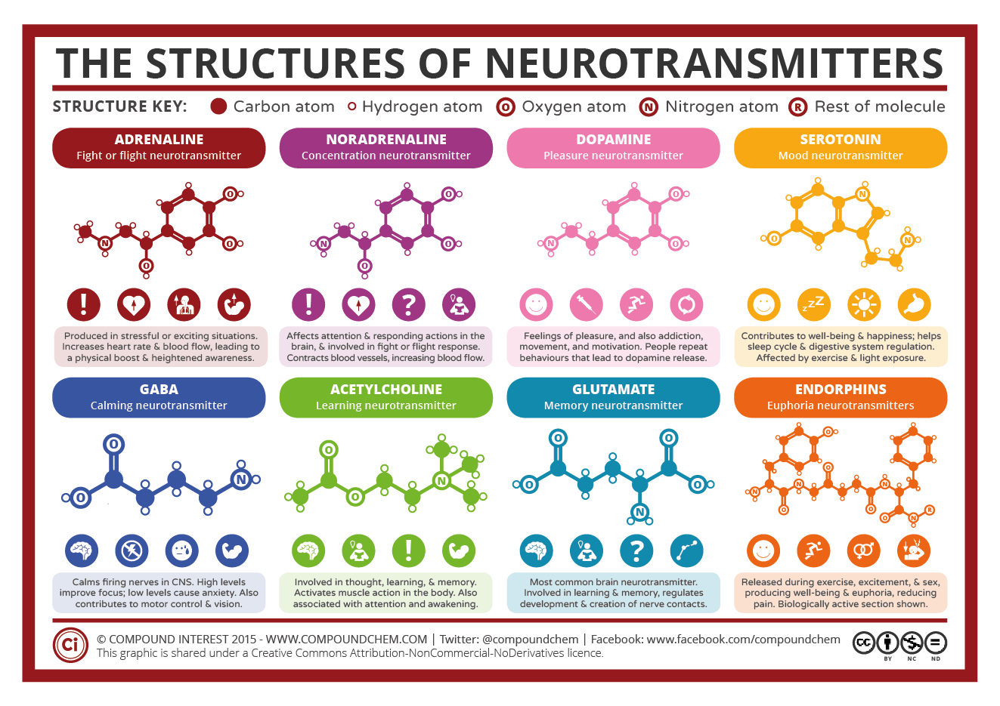

# Casamento ético hacker

_Rascunho em progresso. Previsão de conclusão em algumas décadas._

**Essa filosofia é fortemente baseada em [ética hacker](https://pt.wikipedia.org/wiki/%C3%89tica_hacker)
e [ciência cognitiva](https://en.wikipedia.org/wiki/Cognitive_science)** como
um meio de melhorar qualidade de vida. Atinge isso via objetivo de formar
uma família resiliente onde você e parceiro necessariamente irão replicar versão de vocês
através de uma ou mais entidades inteligentes altamente evoluídas,
que podem gerar conhecimento inovador mesmo após você ter morte cerebral. Vamos
chamar essas entidades como _legado via proxie_.

Essa filosofia usa ética, estudos cognitivos sociais e outras informações
científicas para maximizar felicidade individual e familiar de um novo núcleo.
Pessoa parceira é sua _terapeuta pessoal_ e _motivadora profissional_.

Você se sente inseguro com seu corpo? Sem problema! **Como foca a longo prazo,
sua aparência física é insignificante**, sua mente é o que importa. Você não
está contente com sua mente? Como insegurança por experiências anteriores,
tem um gênio que ate ontém diziam ser difícil, etc? Ok. Isto é para você.

- Alguém com 30 hoje pode viver tranquilamente até os 90-100 anos;
  - Isso daria 60 anos em um casamento, 2 de 30, 4 de 15...
  - Média no brasil de divórcio é 15 anos; esta média vem caindo _(Nota: cair é ruim)_
  - Se você é filho de pais separados, tem mais chance de se separar também;
    - Isso se aplica recursivamente aos seus filhos
  - Pertinente: divórcio costuma
- Casamento ético implica além de felicidade, duração extremamente longa; pense [bodas de diamante](http://www.portaldafamilia.org/datas/bodas/bodas.shtml) considerando expectativa de vida
- Um _hacking_ no conceito de casamento é... ser _mais_ do que um casamento típico
- ...

<!-- - Casamento hacker implica em genitores/tutores se otimizarem constantemente,
indo além de afeto e filhos para empregar muita energia para ajudar parceiro de forma estratégica,
melhorando interesse mútuo
-->

## Visão geral

Vamos supor que você é um hacker, não restrito ao sentido de computador, mas de
alguém que **gostaria de** atingir soluções e efeitos extraordinários, 
que extrapolam o limite imaginado. Não importa quão bom seja, legado via proxie
sempre será melhor: porque poderá se auto-replicar, e atingir soluções não
esperadas hoje.

Você poderia criar _legado via proxie_ trabalhando com inteligência artificial.
Porém mesmo que você atinja isso, o lado lógico, que aprende sozinho, que se
replica... como vai resolver o lado moral, ético? Esta filosofia requer
_legado via proxie_ porque mesmo na pior cenário possível te ajuda a ser melhor,
não ficar restrito a falhas imediatas, porque se durante toda sua expecitativa
muito agora não faz diferença, imagine nos próximos séculos, o que _legado via
proxie_ não deixará de resultado?

@todo continuar parágrafo (fititnt, 2017-02-21 02:16)

<!--
Isso é uma reunião de textos e afins não aleatórios com uma visão típica de 
pessoas programadoras de software, que usam lógica para, mesmo via uso 
consciente ou leitura mais empatia de recursos e comportamentos, atingem um
objetivo lógico e desejado para todos os envolvidos. O foco neste caso é
explicitamente é relacionamento estável com qualidade de vida com um patamar
de felicidade muito acima do que seria da média esperada a partir dos anos 10.
-->

<!-- [Biohacking](https://en.wikipedia.org/wiki/Biohacking) e [neurohacking](https://en.wikipedia.org/wiki/Neurohacking) são interessantes para conhecer, porém implicam em modificar o prório corpo. -->

## Conceitos de interesse
Neste momento este rascunho é literalmente um despejo de ideias tanto recentes
como algumas de uma ou duas décadas atrás. Quando tenho algum tempo livre
e algo a acrescentar posso vir aqui novamente.

**Pra quem tem interesse em saber fundamento mais técnico de onde tirei algumas
ideias vale a pena dar uma olhada ao menos nesses conceitos.**

## Neutotransmissores

Veja http://www.compoundchem.com/2015/07/30/neurotransmitters/ .

@todo continhar explicação (fititnt, 2017-02-21 03:03)

## O Fluxo - Flow

Assuma a hipótese de uma escala entre sua habilidade para fazer uma tarefa e o desafio percebido desta tarefa. 

)

**TODO: atualizar isso outra hora (@fititnt, 2017-02-18 20:52)**

### Teoria Social Cognitiva - Social cognitive theory (SCT)

Esta é uma teoria onde, além do conceito de que um indivíduo pode aprender algo
através de sua experiência própria, ele também aprende via observação de outros.
É mais comum encontrar artigos técnicos a respeito se SCT na área de educação e
negócios do que psicologia pura, embora o maior interesse seja em psicologia
aplicada na saúde.

Essa teoria é muito usada por terapias que ajudam na mudança de comportamentos
indesejáveis e, claro, mesmo que seus praticantes não saibam a origem, também
para ensinar e fixar conhecimento ou comportamentos em outros de forma positiva. 

Veja https://en.wikipedia.org/wiki/Social_cognitive_theory